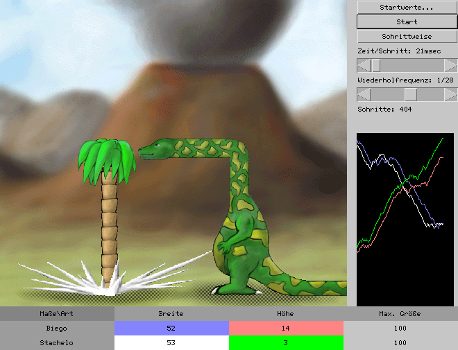

BSEvolution
===========

BSEvolution is a toy like program to simulate the hypothetical
evolution of a biegosaurus and a stachelophyte.

A biegosaurus is an dinosaur with a long neck at an angle of 90
degrees. It wants to eat the stachelophyte. The stachelophyte on the
other site protects itself with some poision spikes.

The source code of the programm is maybe interessting for educational
purpose or as example of a simple java application. It doesn't have
any real use.

